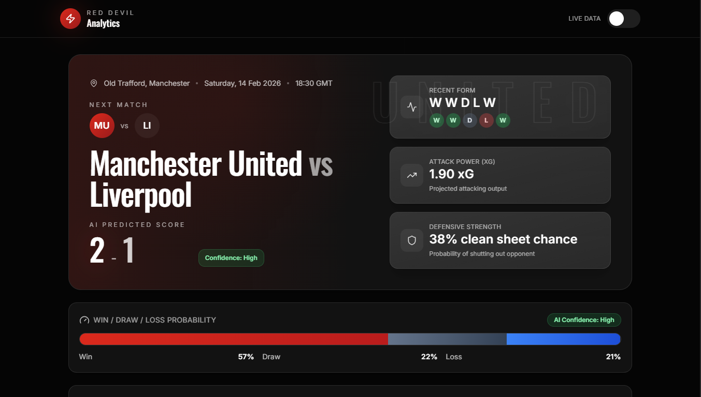

# Red Devil Analytics - Frontend 🔴😈

A high-performance, visually stunning web dashboard providing data-driven insights and AI predictions for Manchester United fixtures.

 

## 🚀 Overview

Red Devil Analytics Frontend is a modern React-based dashboard designed for football enthusiasts and data analysts. It translates complex match data into intuitive visualizations, focusing on "Manchester United" performance metrics, AI-generated score predictions, and probability distributions.

## ✨ Key Features

- **AI Score Prediction:** Real-time projected scores with confidence intervals (e.g., High/Medium/Low).
- **Match Insights:** Detailed breakdown of Attack Power (xG) and Defensive Strength (Clean Sheet probability).
- **Form Analysis:** Visual representation of recent match results (W/D/L).
- **Live Data Toggle:** Switch between historical data and live match updates.
- **Dynamic Probability Bar:** Visual win/draw/loss percentage breakdown.
- **Dark Mode UI:** Sleek, "Red Devil" themed aesthetic for high readability.

## 🛠️ Tech Stack

- **Frontend:** React.js / Vite
- **Styling:** Tailwind CSS (for modern, responsive layouts)
- **Icons:** Lucide React / FontAwesome
- **Animations:** Framer Motion (optional, if used)
- **Data Fetching:** Axios / TanStack Query

## 📥 Installation

1. **Clone the repository:**
   ```bash
   git clone [https://github.com/Zephyrus-not-available/RedDevilAnalytics_Frontend.git](https://github.com/Zephyrus-not-available/RedDevilAnalytics_Frontend.git)
   cd RedDevilAnalytics_Frontend
